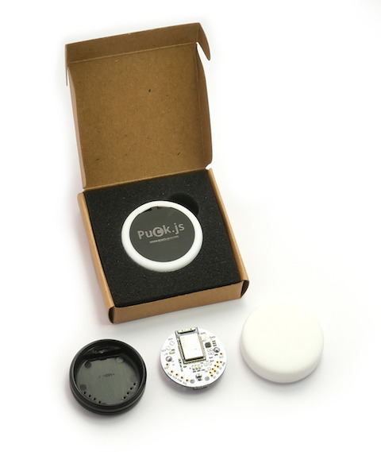
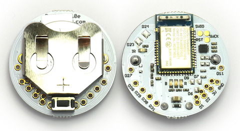
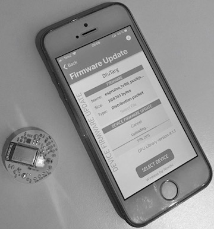
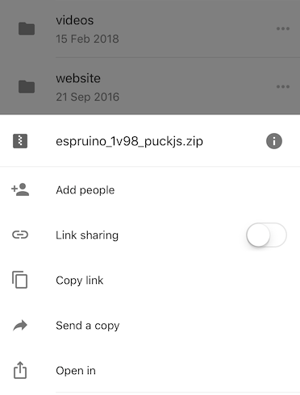
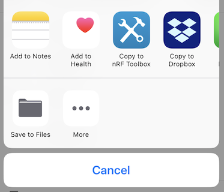

# BLE pushbutton with counter

The [Espruino](https://www.espruino.com) [Puck.js](https://www.espruino.com/Puck.js) is a BLE smart button with JavaScript support out-of-the-box. 

If you are looking for a WiFi button the [AWS IoT button](https://aws.amazon.com/iotbutton/) could be a better match.

The Puck.js started out as a [Kickstarter](https://www.kickstarter.com/projects/gfw/puckjs-the-ground-breaking-bluetooth-beacon) project, but it is not just button. IT also has NFC, magnetometer, temperature sensor, RGB LEDs, IR Transmitter,  I2C, SPI and USART etc.
Making it a very versatile piece of hardware, all packed in a fun enclosure!

Puck.js comes with the Open Source JavaScript interpreter Espruino pre-installed. It has a very nice IDE you can run from your browser and lot of examples to get you started. Here is a list of the features from their website.

Features:

* Espruino JavaScript interpreter pre-installed
* nRF52832 SoC - Cortex M4, 64kB RAM, 512kB Flash
* 8 x 0.1" GPIO (capable of PWM, SPI, I2C, UART, Analog Input)
* 9 x SMD GPIO (capable of PWM, SPI, I2C, UART)
* ABS plastic rear case with lanyard mount
* Silicone cover with tactile button
* MAG3110 Magnetometer
* IR Transmitter
* Built in thermometer, light and battery level sensors
* Red, Green and Blue LEDs
* NFC tag programmable from JavaScript
* Pin capable of capacitive sensing

The hardware is very cool:

The first thing you need to-do is to upgrade the firmware. Check the "Firmware Updates" section in the [puck.js](https://www.espruino.com/Puck.js) documentation.

This is what is looks like when you are updating the firmware, you just use your Android or iOS phone to get the job done.

* On your Bluetooth LE capable phone, install the nRF Toolbox app
* Download the latest espruino_xxx_puckjs.zip file from the [binaries folder](http://www.espruino.com/binaries/)
* Reset Puck.js so that it is in "DfuTarg" mode, to accomplish this do the following:
	* Take out the battery
	* Press the button
	* Re-insert the battery
	* Release the button within 3 seconds of inserting the battery
	* Red LED should light, success!
	* If it doesn't, you'll need to try again
* Open the nRF Toolbox app
* Tap the DFU icon
* Tap Select File, choose Distribution Packet (ZIP), and choose the ZIP file you downloaded. In iOS you can download the file to gDrive 
	* and then choose to "open in", 
	* 
	* then you can choose "Copy to nRF Toolbox"  
	* 

* Tap Select Device and choose the device called DfuTarg
* Now tap Upload and wait. The LED should turn blue and the DFU process will start - it will take around 90 seconds to complete
* If you have problems after completion, perform a "Hard Reset" and try again

The code to our proejct can be found in the [puckjs-code](https://github.com/HiMinds/himinds-iot-project-embedded-sensor-pushbutton-ble/tree/master/puckjs-code) folder.
